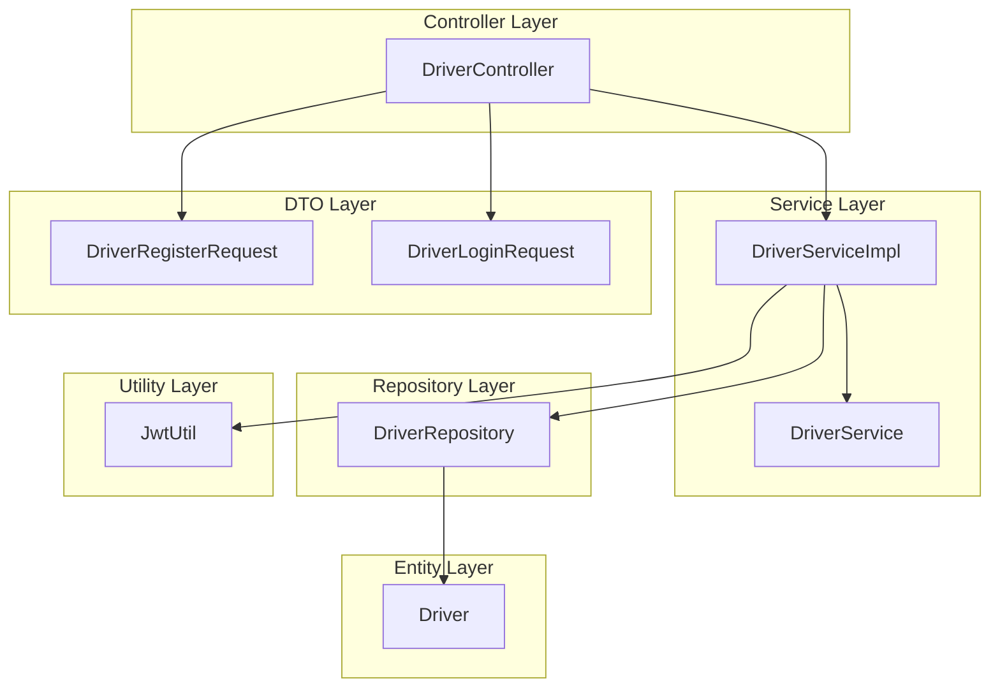

# Driver Module 

## Module Overview 

The **Driver Module** manages driver-related functionalities within the Cab Booking System. It includes operations such as driver registration, login, profile retrieval, and status updates. Secure authentication and authorization are implemented using JWT tokens, enabling seamless interaction between drivers and the system.

### Key Features:
- **Driver Registration**: Enables new drivers to register with their details.
- **Driver Login**: Authenticates drivers and generates JWT tokens for secure access.
- **Profile Management**: Retrieves driver profile information using authentication tokens.
- **Status Update**: Allows drivers to update their availability status.

The module follows a layered architecture to ensure separation of concerns and scalability. It integrates with other modules, such as Ride Booking, to deliver a unified experience for drivers.

---

## Table Design

### Driver Table
| Column Name       | Data Type         | Constraints                  | Description                     |
|-------------------|-------------------|------------------------------|---------------------------------|
| **driverId**      | BIGINT            | Primary Key, Auto Increment  | Unique identifier for the driver |
| **name**          | VARCHAR(255)      | Not Null                     | Name of the driver              |
| **phone**         | VARCHAR(15)       | Unique, Not Null             | Phone number of the driver      |
| **licenseNumber** | VARCHAR(255)      | Unique                       | Driver's license number         |
| **vehicleDetails**| VARCHAR(255)      | Not Null                     | Details of the driver's vehicle |
| **passwordHash**  | VARCHAR(255)      | Not Null                     | Hashed password for security    |
| **available**     | BOOLEAN           | Not Null                     | Availability status of the driver |
| **role**          | ENUM              | Not Null                     | Role of the driver (e.g., DRIVER) |

---

## Flowchart 

### Layered Architecture of Driver Module

The Driver Module is structured with a layered architecture to ensure separation of concerns, scalability, and maintainability. Below is the breakdown of the layers:

1. **Controller Layer**
   - **Purpose**: Handles HTTP requests and maps them to service methods.
   - **Component**: DriverController
   - **Endpoints**:
     - `POST /api/drivers/register`: Handles driver registration.
     - `POST /api/drivers/login`: Handles driver login and JWT generation.
     - `GET /api/drivers/available`: Retrieves available drivers.
     - `PUT /api/drivers/status`: Updates driver availability status.
     - `GET /api/drivers/profile`: Retrieves driver profile information.

2. **Service Layer**
   - **Purpose**: Contains the business logic for driver-related operations.
   - **Components**:
     - DriverServiceImpl: Implements the business logic for driver registration, login, profile retrieval, and status updates.
     - DriverService: Interface defining the contract for driver-related services.

3. **Repository Layer**
   - **Purpose**: Interacts with the database to perform CRUD operations on the Driver entity.
   - **Component**: DriverRepository
   - **Methods**:
     - `findByAvailableTrue()`: Retrieves all available drivers.
     - `findByPhone(String phone)`: Retrieves a driver by phone number.

4. **Entity Layer**
   - **Purpose**: Represents the driver entity in the database.
   - **Component**: Driver
   - **Attributes**:
     - driverId: Unique identifier for the driver.
     - name: Name of the driver.
     - phone: Phone number of the driver.
     - licenseNumber: Driver's license number.
     - vehicleDetails: Details of the driver's vehicle.
     - passwordHash: Hashed password for security.
     - available: Availability status of the driver.
     - role: Role of the driver (e.g., DRIVER).

5. **DTO Layer**
   - **Purpose**: Facilitates data transfer between layers.
   - **Components**:
     - DriverRegisterRequest: DTO for driver registration.
     - DriverLoginRequest: DTO for driver login.

6. **Utility Layer**
   - **Purpose**: Provides utility functions for the module.
   - **Component**: JwtUtil
   - **Functions**:
     - Generate JWT tokens.
     - Validate JWT tokens.
     - Extract driver information from tokens.