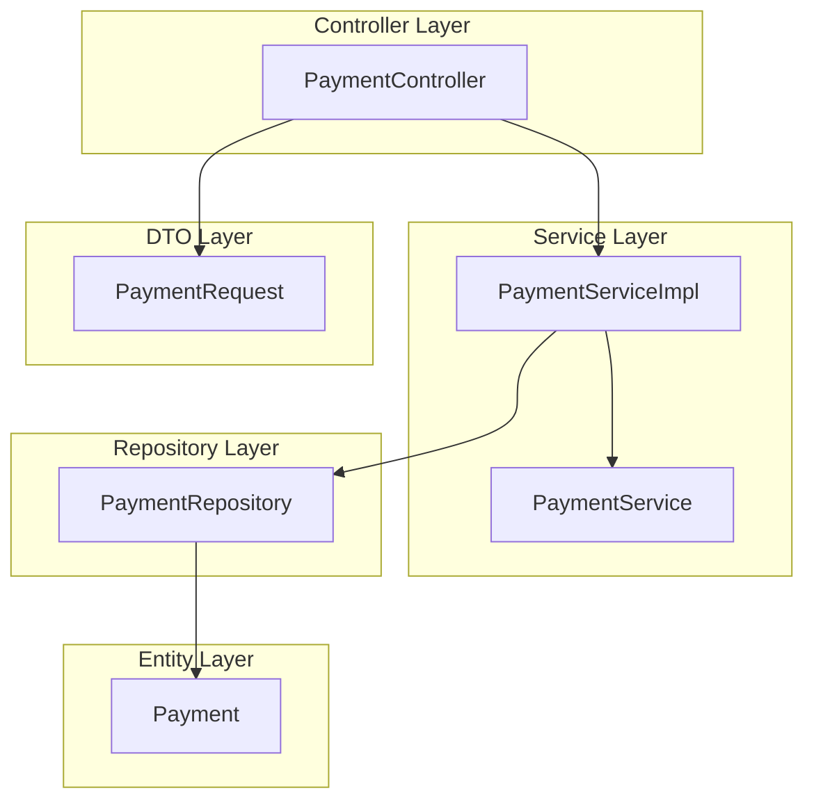

# Payment Module 

## Module Overview 
The **Payment Module** manages payment-related functionalities within the Cab Booking System, including processing payments and retrieving payment receipts. It ensures secure and efficient payment handling for completed rides.

### Key Features:
- **Process Payment**: Enables users to make payments for completed rides.
- **Retrieve Payment Receipt**: Provides users with detailed receipts for their payments.

The module follows a layered architecture for separation of concerns and scalability. It interacts with other modules like Ride Booking and User Management to deliver a seamless experience.

---

# Table Design

## Payment Table
| Column Name       | Data Type         | Constraints                  | Description                     |
|-------------------|-------------------|------------------------------|---------------------------------|
| **paymentId**     | BIGINT            | Primary Key, Auto Increment  | Unique identifier for the payment |
| **rideId**        | BIGINT            | Foreign Key                  | Reference to the ride associated with the payment |
| **userId**        | BIGINT            | Foreign Key                  | Reference to the user making the payment |
| **amount**        | DOUBLE            | Not Null                     | Amount paid for the ride        |
| **method**        | ENUM              | Not Null                     | Payment method (e.g., CASH, CARD, UPI) |
| **status**        | VARCHAR(50)       | Not Null                     | Status of the payment (e.g., SUCCESS) |
| **timestamp**     | TIMESTAMP         | Not Null                     | Timestamp of the payment        |

---

# Flowchart 

---

# Layered Architecture of Payment Module

The Payment Module is designed with a layered architecture to ensure separation of concerns, scalability, and maintainability. Below is the breakdown of the layers:

### 1. Controller Layer
**Purpose**: Handles HTTP requests and maps them to service methods.  
**Component**: `PaymentController`  
**Endpoints**:  
- `POST /api/payments/process`: Handles payment processing for completed rides.  
- `GET /api/payments/receipt/{rideId}`: Retrieves the payment receipt for a specific ride.  

### 2. Service Layer
**Purpose**: Contains the business logic for payment-related operations.  
**Components**:  
- `PaymentServiceImpl`: Implements the business logic for processing payments and retrieving receipts.  
- `PaymentService`: Interface defining the contract for payment-related services.  

### 3. Repository Layer
**Purpose**: Interacts with the database to perform CRUD operations on the Payment entity.  
**Component**: `PaymentRepository`  
**Methods**:  
- `findByRideRideId(Long rideId)`: Retrieves the payment associated with a specific ride.  

### 4. Entity Layer
**Purpose**: Represents the payment entity in the database.  
**Component**: `Payment`  
**Attributes**:  
- `paymentId`: Unique identifier for the payment.  
- `ride`: Reference to the ride associated with the payment.  
- `user`: Reference to the user making the payment.  
- `amount`: Amount paid for the ride.  
- `method`: Payment method (e.g., CASH, CARD, UPI).  
- `status`: Status of the payment (e.g., SUCCESS).  
- `timestamp`: Timestamp of the payment.  

### 5. DTO Layer
**Purpose**: Facilitates data transfer between layers.  
**Component**:  
- `PaymentRequest`: DTO for processing payments.  