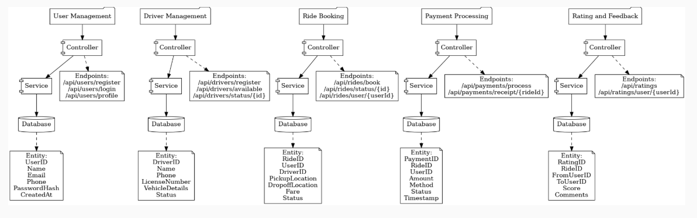

# Project Overview
# Project Introduction

The **Cab Booking System** is a comprehensive application designed to simplify the process of booking rides, managing drivers, processing payments, and collecting feedback. It provides a seamless experience for users and drivers, ensuring efficient ride management and payment processing. The system is built with modular components to handle user management, driver management, ride booking, payment processing, and rating/feedback functionalities. Each module is designed to interact cohesively, delivering a robust and scalable solution for cab booking services.

# Architecture Diagram

# Technologies used
## Backend
- **Framework**: Spring Boot
- **Database**: MySQL
- **Authentication**: JWT (JSON Web Tokens)
- **ORM**: Hibernate (via Spring Data JPA)
- **Security**: Spring Security
- **Build Tool**: Maven

## Frontend 
- **Framework**: React.js
- **Styling**: CSS/Bootstrap

## Other Tools and Libraries
- **Logging**: SLF4J and Logback
- **Dependency Management**: Lombok
- **API Documentation**: Swagger/OpenAPI
- **Testing**: JUnit and Mockito

# Backend Dependecies

- **Spring Boot Starter Web**: For building RESTful APIs.
- **Spring Boot Starter Security**: For implementing authentication and authorization.
- **Spring Boot Starter Data JPA**: For ORM and database interactions using Hibernate.
- **Spring Boot Starter Validation**: For validating request payloads.
- **Spring Boot Starter Test**: For testing with JUnit and Mockito.
- **Spring Boot Starter Logging**: For logging with SLF4J and Logback.
- **Lombok**: For reducing boilerplate code (e.g., getters, setters, constructors).
- **JWT Utilities**: For generating and validating JSON Web Tokens.
- **MySQL Connector**: For connecting to the MySQL database.
- **Swagger/OpenAPI**: For API documentation and testing.

# Module Documentation
[User Module](User_Module.md)

[Driver Module](Driver_Module.md)

[Ride Module](Ride_Module.md)

[Payment Module](Payment_Module.md)

[Rating Module](Rating_Module.md)