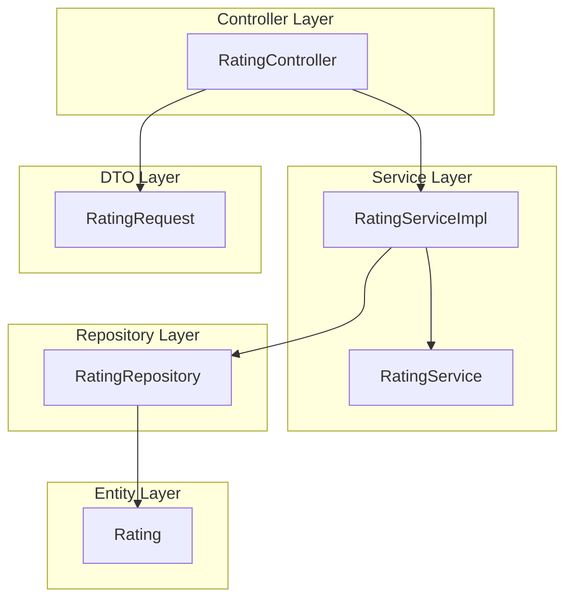

# Rating Module 

## Module Overview 
The **Rating Module** manages rating and feedback functionalities within the Cab Booking System. It enables users to rate drivers after rides and allows drivers to access their ratings. This module promotes transparency and service quality improvement.

### Key Features:
- **Submit Rating**: Users can rate drivers and provide optional feedback after rides.
- **Retrieve Ratings**: Drivers can view their ratings and user feedback.

The module uses a layered architecture for scalability and separation of concerns. It integrates with Ride Booking and Driver Management modules for a seamless experience.

---

# Table Design

## Rating Table
| Column Name       | Data Type         | Constraints                  | Description                     |
|-------------------|-------------------|------------------------------|---------------------------------|
| **ratingId**      | BIGINT            | Primary Key, Auto Increment  | Unique identifier for the rating |
| **rideId**        | BIGINT            | Foreign Key                  | Reference to the ride associated with the rating |
| **fromUserId**    | BIGINT            | Foreign Key                  | Reference to the user providing the rating |
| **toUserId**      | BIGINT            | Foreign Key                  | Reference to the driver receiving the rating |
| **score**         | INT               | Not Null                     | Rating score (e.g., 1 to 5)     |
| **comments**      | VARCHAR(255)      | Optional                     | Feedback comments               |

---

# Flowchart 

---

## Layered Architecture of Rating Module

The Rating Module is designed with a layered architecture to ensure separation of concerns, scalability, and maintainability. Below is the breakdown of the layers:

### 1. Controller Layer
**Purpose**: Handles HTTP requests and maps them to service methods.  
**Component**: `RatingController`  
**Endpoints**:  
- `POST /api/ratings`: Handles submission of ratings and feedback.  
- `GET /api/ratings/driver/ratings`: Retrieves ratings for the logged-in driver.  

### 2. Service Layer
**Purpose**: Contains the business logic for rating-related operations.  
**Components**:  
- `RatingServiceImpl`: Implements the business logic for submitting ratings and retrieving ratings for drivers.  
- `RatingService`: Interface defining the contract for rating-related services.  

### 3. Repository Layer
**Purpose**: Interacts with the database to perform CRUD operations on the Rating entity.  
**Component**: `RatingRepository`  
**Methods**:  
- `findByToUserId(Long toUserId)`: Retrieves ratings for a specific driver.  

### 4. Entity Layer
**Purpose**: Represents the rating entity in the database.  
**Component**: `Rating`  
**Attributes**:  
- `ratingId`: Unique identifier for the rating.  
- `ride`: Reference to the ride associated with the rating.  
- `fromUserId`: Reference to the user providing the rating.  
- `toUserId`: Reference to the driver receiving the rating.  
- `score`: Rating score (e.g., 1 to 5).  
- `comments`: Feedback comments.  

### 5. DTO Layer
**Purpose**: Facilitates data transfer between layers.  
**Component**:  
- `RatingRequest`: DTO for submitting ratings and feedback.  