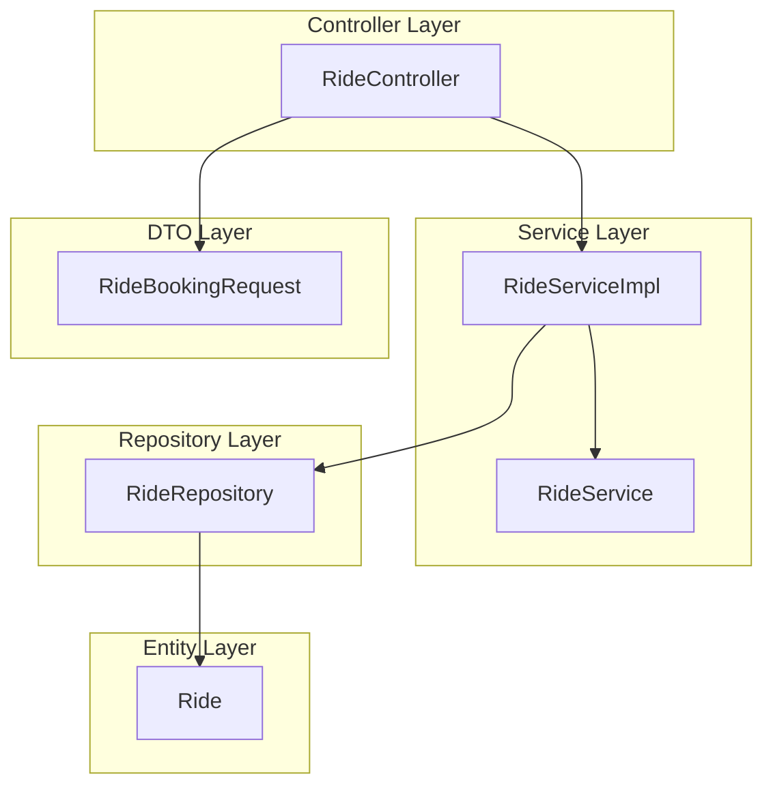

# Ride Module 

## Module Overview 
The **Ride Module** manages ride-related functionalities within the Cab Booking System, including booking rides, updating ride statuses, and retrieving ride history. It ensures smooth interaction between users and drivers for efficient ride management.

### Key Features:
- **Ride Booking**: Users can book rides by specifying pickup and dropoff locations.
- **Ride Status Update**: Drivers can update ride statuses (e.g., REQUESTED, IN_PROGRESS, COMPLETED).
- **Ride History Retrieval**: Users can view their past rides.

The module follows a layered architecture for scalability and separation of concerns. It integrates with User Management and Driver Management modules for a seamless experience.

---

# Table Design

## Ride Table
| Column Name       | Data Type         | Constraints                  | Description                     |
|-------------------|-------------------|------------------------------|---------------------------------|
| **rideId**        | BIGINT            | Primary Key, Auto Increment  | Unique identifier for the ride |
| **userId**        | BIGINT            | Foreign Key                  | References the user who booked the ride |
| **driverId**      | BIGINT            | Foreign Key                  | References the driver assigned to the ride |
| **pickupLocation**| VARCHAR(255)      | Not Null                     | Pickup location for the ride   |
| **dropoffLocation**| VARCHAR(255)     | Not Null                     | Dropoff location for the ride  |
| **fare**          | DOUBLE            | Not Null                     | Fare for the ride              |
| **status**        | ENUM              | Not Null                     | Status of the ride (e.g., REQUESTED, IN_PROGRESS, COMPLETED) |

---

# Flowchart 

### Layered Architecture of Ride Module
The Ride Module is structured with a layered architecture for maintainability and scalability. Below is the breakdown of its layers:

1. **Controller Layer**
   - **Purpose**: Handles HTTP requests and maps them to service methods.
   - **Component**: RideController
   - **Endpoints**:
     - `POST /api/rides/book`: Handles ride booking.
     - `PUT /api/rides/status`: Updates the status of a ride.
     - `GET /api/rides/user/rides`: Retrieves ride history for a user.

2. **Service Layer**
   - **Purpose**: Contains business logic for ride-related operations.
   - **Components**:
     - RideServiceImpl: Implements ride booking, status updates, and ride retrieval logic.
     - RideService: Defines the contract for ride-related services.

3. **Repository Layer**
   - **Purpose**: Interacts with the database for CRUD operations on the Ride entity.
   - **Component**: RideRepository
   - **Methods**:
     - `findByUserUserId(Long userId)`: Retrieves rides for a specific user.
     - `findByDriverDriverId(Long driverId)`: Retrieves rides assigned to a specific driver.

4. **Entity Layer**
   - **Purpose**: Represents the ride entity in the database.
   - **Component**: Ride
   - **Attributes**:
     - rideId: Unique identifier for the ride.
     - user: Reference to the user who booked the ride.
     - driver: Reference to the driver assigned to the ride.
     - pickupLocation: Pickup location for the ride.
     - dropoffLocation: Dropoff location for the ride.
     - fare: Fare for the ride.
     - status: Status of the ride (e.g., REQUESTED, IN_PROGRESS, COMPLETED).

5. **DTO Layer**
   - **Purpose**: Facilitates data transfer between layers.
   - **Component**: RideBookingRequest (DTO for ride booking).