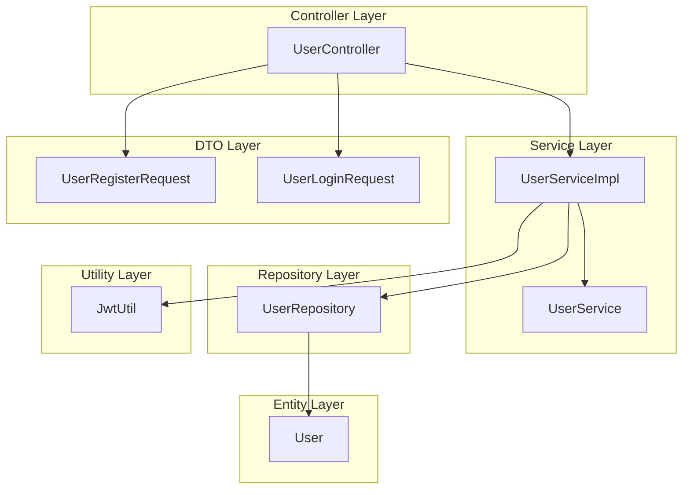

# User Module 

## Module overview 
The **User Module** is responsible for managing user-related functionalities within the Cab Booking System. It handles operations such as user registration, login, profile retrieval, and logout. This module ensures secure authentication and authorization using JWT tokens and provides seamless interaction between the user and the system.

### Key Features:
- **User Registration**: Allows new users to register with their details.
- **User Login**: Authenticates users and generates JWT tokens for secure access.
- **Profile Management**: Retrieves user profile information based on authentication tokens.
- **Logout**: Handles user logout functionality.

The module is designed with a layered architecture, ensuring separation of concerns and scalability. It interacts with other modules such as Ride Booking and Payment Processing to provide a cohesive user experience.

# Table Design

## User Table
| Column Name     | Data Type         | Constraints                  | Description                     |
|-----------------|-------------------|------------------------------|---------------------------------|
| **userId**      | BIGINT            | Primary Key, Auto Increment  | Unique identifier for the user |
| **name**        | VARCHAR(255)      | Not Null                     | Name of the user               |
| **email**       | VARCHAR(255)      | Unique, Not Null             | Email address of the user      |
| **phone**       | VARCHAR(15)       | Unique, Not Null             | Phone number of the user       |
| **passwordHash**| VARCHAR(255)      | Not Null                     | Hashed password for security   |
| **role**        | ENUM              | Not Null                     | Role of the user (e.g., USER)  |
| **createdAt**   | TIMESTAMP         | Not Null                     | Timestamp of user creation     |


# Flowchart 



# Layered Architecture of User Module

The **User Module** is designed with a layered architecture to ensure separation of concerns, scalability, and maintainability. Below is the breakdown of the layers:

## 1. Controller Layer
- **Purpose**: Handles HTTP requests and maps them to service methods.
- **Component**: `UserController`
  - Endpoints:
    - `POST /api/users/register`: Handles user registration.
    - `POST /api/users/login`: Handles user login and JWT generation.
    - `GET /api/users/profile`: Retrieves user profile information.

---

## 2. Service Layer
- **Purpose**: Contains the business logic for user-related operations.
- **Components**:
  - `UserServiceImpl`: Implements the business logic for user registration, login, and profile retrieval.
  - `UserService`: Interface defining the contract for user-related services.

---

## 3. Repository Layer
- **Purpose**: Interacts with the database to perform CRUD operations on the `User` entity.
- **Component**: `UserRepository`
  - Methods:
    - `findByEmail(String email)`: Retrieves a user by email.
    - `findByPhone(String phone)`: Retrieves a user by phone.

---

## 4. Entity Layer
- **Purpose**: Represents the user entity in the database.
- **Component**: `User`
  - Attributes:
    - `userId`: Unique identifier for the user.
    - `name`: Name of the user.
    - `email`: Email address of the user.
    - `phone`: Phone number of the user.
    - `passwordHash`: Hashed password for security.
    - `role`: Role of the user (e.g., USER).
    - `createdAt`: Timestamp of user creation.

---

## 5. DTO Layer
- **Purpose**: Facilitates data transfer between layers.
- **Components**:
  - `UserRegisterRequest`: DTO for user registration.
  - `UserLoginRequest`: DTO for user login.

---

## 6. Utility Layer
- **Purpose**: Provides utility functions for the module.
- **Component**: `JwtUtil`
  - Functions:
    - Generate JWT tokens.
    - Validate JWT tokens.
    - Extract user information from tokens.

---

# User Module Component Diagram

```mermaid
componentDiagram
    UserController --|> UserServiceImpl : calls
    UserServiceImpl ..|> UserService : implements
    UserServiceImpl --> UserRepository : uses
    UserServiceImpl --> JwtUtil : uses
    UserRepository --> User : manages
    UserController --> UserRegisterRequest : uses
    UserController --> UserLoginRequest : uses

    component UserController
    component UserServiceImpl
    interface UserService
    component UserRepository
    class User
    class UserRegisterRequest
    class UserLoginRequest
    component JwtUtil
